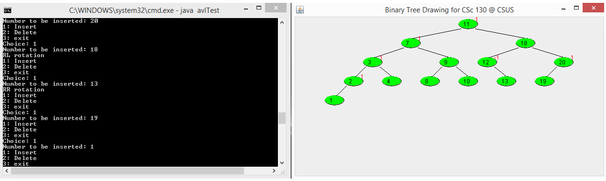

# AVL Tree

A Java implementation of an AVL tree with a GUI display for visualizing the tree structure.



## Background

An AVL tree is a balanced binary search tree where for each node in the tree, the heights of the left and right subtrees differ by at most one. For each node, there is a small red number displayed. This number is called the **balance factor**: height of the left subtree minus the height of the right subtree. After insertion, the deepest node (furthest from root) on the path from the insertion point to the root with a non-zero balance factor is called the **pivot**. After an insertion, the balance factors must be updated. If the balance factor of the pivot is 2 or -2, a rotation is need to rebalance the tree.

## Features

* Insert integer values into an AVL tree
* Delete values from the tree
* Automatically rebalance after insertion
* Supports AVL rotations:

    **LL**: an insertion into the left subtree of the left child of the pivot node
  
     **RL**: an insertion into the right subtree of the left child of the pivot node
  
     **LR**: an insertion into the left subtree of the right child of the pivot node
  
     **RR**: an insertion into the right subtree of the right child of the pivot node

* Displays balance factors for tree nodes
* Visualizes the tree in a GUI window

## Files

```text id="w5xd7s"
AVL.java                  # AVL insertion and rotation logic
avlTest.java              # Console menu and test driver
AVL_Tree_Screenshot.png   # Screenshot of the program
README.md                 # Project documentation
```

## Notes

* The tree stores integer values.
* Duplicate values are not inserted.
* Rotations are printed to the console when rebalancing occurs.
* The GUI updates after each insert or delete operation.
