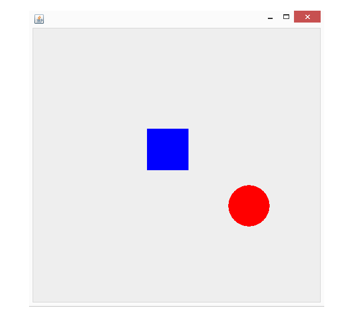

# Bouncing Ball

A simple Java Swing animation that displays a red ball bouncing around a GUI window. The ball changes direction when it hits the window edges or the blue square obstacle in the center.



## Features

* Java GUI built with Swing/AWT
* Animated bouncing ball
* Collision detection with window boundaries
* Collision detection with a center square obstacle

## Files

```text id="ltx9m2"
Bouncing_Ball.java              # Main Java source file
Bouncing_Ball_Screenshot.png    # Screenshot of the program
README.md                       # Project documentation
```

## Notes

* The program opens a 500x500 window.
* The red ball moves continuously and bounces when it reaches a boundary or obstacle.
* The animation loop uses `Thread.sleep()` and `repaint()` to update the display.
