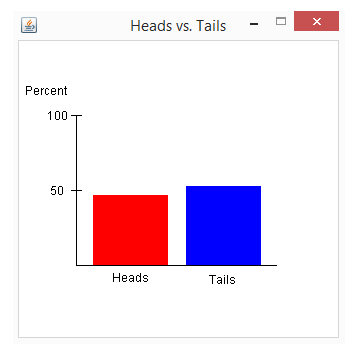

# Coin Flipping Simulation

A Java AWT program that simulates flipping a coin and displays the results in a bar graph.



## Features

* Prompts the user for the number of coin flips
* Randomly simulates heads or tails
* Displays totals and percentages in the console
* Shows a GUI bar graph comparing heads vs. tails

## Files

```text id="xw9q2v"
HeadsVTails.java                         # Main Java source file
Coin_Flipping_Simulation_Screenshot.png  # Screenshot of the program
README.md                                # Project documentation
```

## Notes

* The program opens a 325x325 GUI window.
* Heads are shown in red, and tails are shown in blue.
* The graph is scaled using the percentage of heads and tails.
