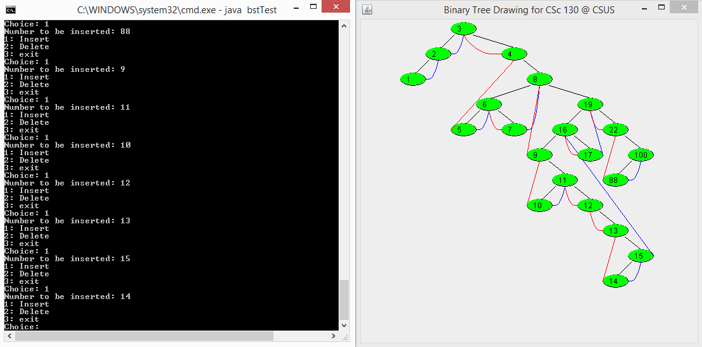

# Threaded Binary Search Tree

A Java implementation of a double-threaded binary search tree with a GUI display for visualizing the tree structure.



## Features

* Insert integer values into the tree
* Delete values from the tree
* Prevent duplicate values from being inserted
* Uses left and right threads for inorder navigation
* Displays the tree in a GUI window
* Updates the visualization after insertions and deletions

## Files

```text id="p4n8vq"
bstTest.java        # Main program, tree logic, and test menu
TBST_Screenshot.png # Screenshot of the program
README.md           # Project documentation
```

## Notes

* The tree stores integer values.
* Threads point to inorder predecessor and successor nodes when child links are not present.
* Threading allows inorder traversal without recursion or a stack.
* The console menu supports inserting values, deleting values, and exiting the program.
